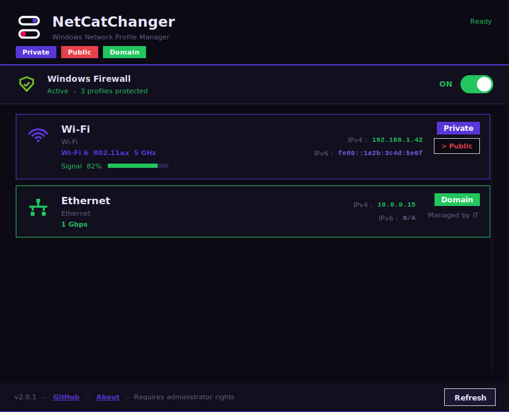

# NetCatChanger

Windows Network Profile Manager + Firewall Control



## Requirements

- Windows 10 / 11
- Python 3.8+  https://python.org  (check "Add to PATH" during install)

## Build

Double-click `scripts\build_windows.bat`

The script does everything automatically:
1. Installs PyInstaller + Pillow via pip
2. Generates `assets\app_icon.ico`
3. Compiles `NetCatChanger.exe` via PyInstaller

You can also trigger a build without a Windows machine via the
**Build Windows EXE** GitHub Actions workflow (Actions tab -> Run workflow).
It runs on a real Windows runner and produces the same `.exe` as an
artifact you can download.

## Run without building

Double-click `scripts\run_as_admin.bat`

## Debug

Double-click `scripts\debug.bat` (shows errors if the app crashes on launch)

## Project structure

```
NetCatChanger/
├── src/                    Application source
│   ├── network_switcher.py Main application
│   ├── icons.py             Pre-rendered icons (no external deps at runtime)
│   ├── gen_icon.py          Generates assets/app_icon.ico at build time
│   └── version_info.txt     Windows exe metadata
├── assets/                  Icons and images
│   ├── app_icon.ico
│   ├── *.svg                Original icon sources (not used at runtime)
│   └── screenshot.png
├── scripts/                 Windows launcher scripts
│   ├── build_windows.bat    Build script (exe)
│   ├── run_as_admin.bat     Launch without building
│   └── debug.bat            Debug launcher
└── .github/workflows/       CI build (Windows runner via GitHub Actions)
```

## License

GNU General Public License v3.0 - see [LICENSE](LICENSE).
