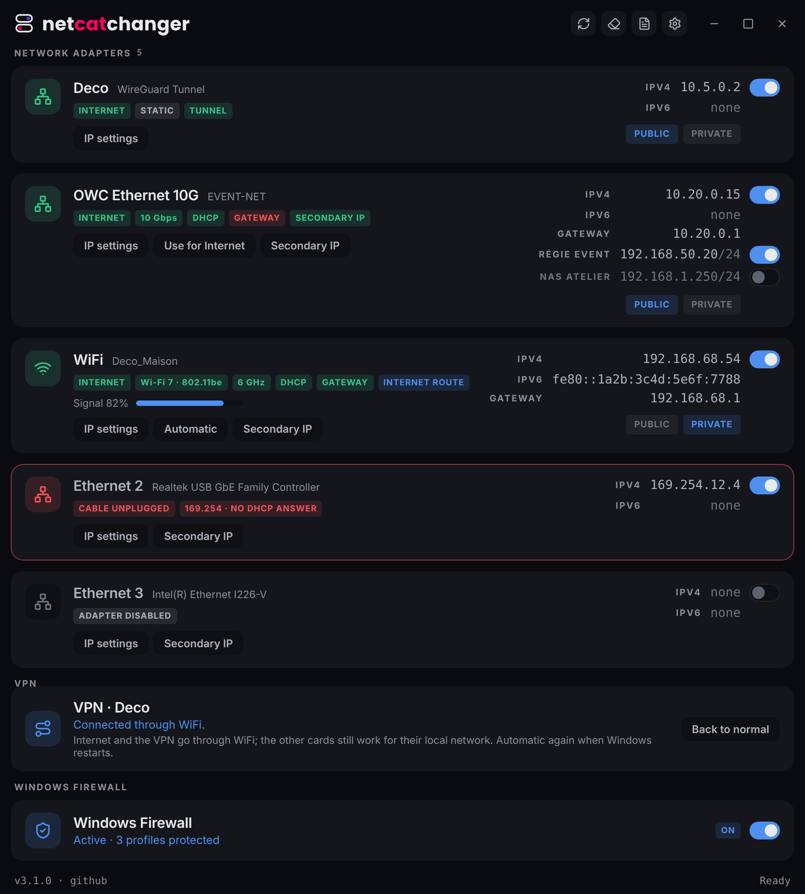
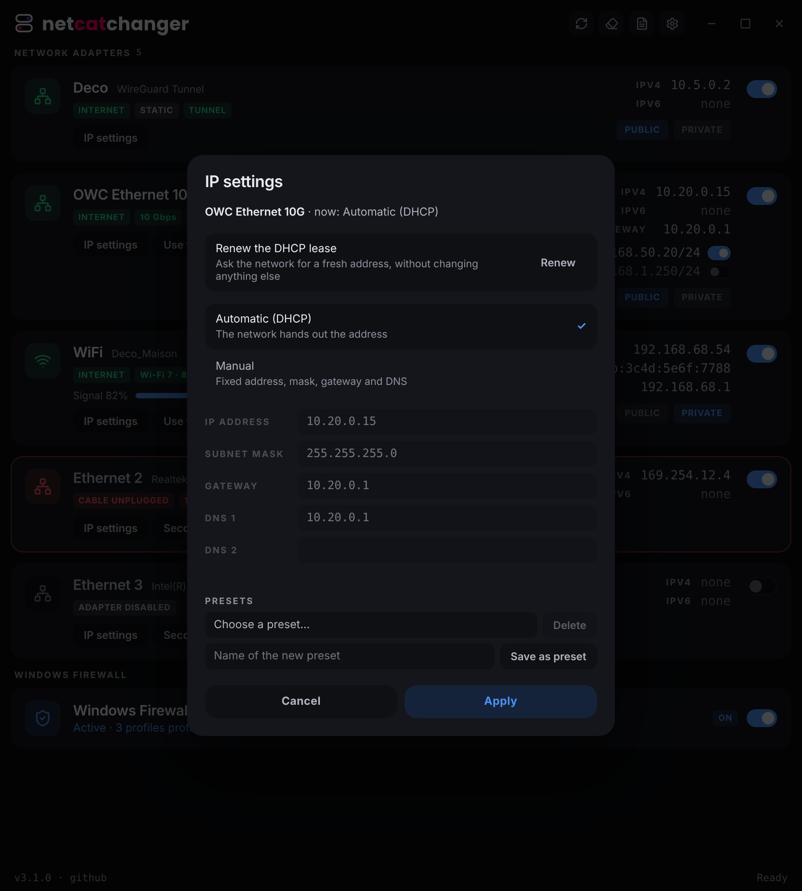
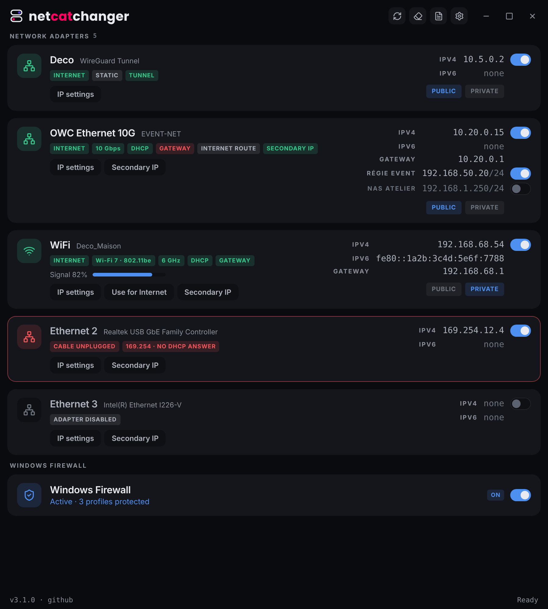

# NetCatChanger

Windows network profiles, IP settings and firewall, in one window.

Open it, change what you need, close it: NetCatChanger keeps nothing
running in the background.



| IP settings, with presets and automatic undo | Secondary addresses |
|---|---|
|  |  |

## Download

Get `NetCatChanger-Setup-<version>.exe` from the
[Releases](https://github.com/noar-justedit/netcatchanger/releases/latest).
Upgrading from 2.x: just run the new installer, it removes the old version
and keeps your settings and IP presets.

Windows SmartScreen may warn on first launch (the installer is not signed):
*More info*, then *Run anyway*.

## Features

- **Every network adapter on one screen**, disabled and unplugged ones
  included: IPv4 / IPv6 / gateway, DHCP or static, Wi-Fi standard, band and
  signal, link speed, WireGuard tunnels.
- **INTERNET badge** on each adapter that reaches the Internet (Windows' own
  verdict, the one behind the taskbar network icon), and a gateway ping.
- **Public / Private** in one click, with Undo.
- **IP settings**: DHCP or a fixed address (IP, mask, gateway, two DNS),
  saved **presets**, and an automatic return to the previous settings after
  15 seconds unless you confirm, in case the change cuts you off.
- **Secondary IP**: a second fixed address on another range next to the DHCP
  one, to reach a NAS or event equipment without losing the Internet. One
  ON / OFF switch per address, presets, never a gateway, duplicates refused
  (Windows 10 2004 or later).
- **Use for Internet**: Wi-Fi and Ethernet both connected, one click picks
  which one carries the Internet (and the VPN); the other keeps its local
  network. Automatic again in one click, or when Windows restarts.
- **Turn an adapter on / off** with its switch, **rename** it (right-click on
  its name), **renew** a DHCP lease (in IP settings), **flush DNS**.
- **Windows Firewall** on / off, for the active profiles only or for all.
- **VPN** (WireGuard): while a tunnel runs, shows which connection it uses
  and whether its server answers. If a network blocks it, one click sends it
  through another connection (the Wi-Fi, say), like "Use for Internet"; the
  first one keeps working for everything else, and a restart of Windows puts
  things back by itself.
- **Session log** of every change in `%APPDATA%\NetCatChanger\session.log`.
- The live window refreshes by itself when something changes in Windows.

Administrator rights are required (Windows asks once at launch).

## Requirements

Windows 10 or 11, 64-bit.

## Build

On Windows, with [Node.js LTS](https://nodejs.org) installed, double-click:

```
scripts\build_windows.cmd
```

It installs the build tools, downloads Electron once (resumable, checksum
verified, cached in `%LOCALAPPDATA%\NetCatChanger-build`), runs the checks
(`npm test`) and produces `dist\NetCatChanger-Setup-<version>.exe`.

The installer removes a NetCatChanger 2.x it finds, and its "Launch with
Windows" task. Settings and IP presets are kept.

## Checks without Windows

```
npm install
npm test
```

The parsers (netsh output in English, French and German, adapter list,
WireGuard state, VPN exit logic), what reaches PowerShell, the UI rules and
the scripts are checked on any machine.

## Project structure

```
src/main/        main process: window, security, actions on Windows
  ps/            PowerShell scripts (read by Node, passed as text)
src/renderer/    the window: index.html, style.css, app.js
test/            npm test
scripts/         build_windows.cmd, fetch-electron.js, push_github.cmd (Windows)
build-resources/ icon, installer additions (2.x migration)
assets/          logo, Lucide icon sources
docs/            screenshots, release notes
```

Working notes for whoever continues the project: `AGENTS.md` (rules),
`ETAT_PROJET.md` (state, decisions, version locations), `CHANGELOG.md`.

## Licence

GNU General Public License v3.0 (see `LICENSE`). Icons by
[Lucide](https://lucide.dev), ISC (see `LICENSE-lucide.txt`). Poppins
typeface, SIL Open Font License 1.1.
