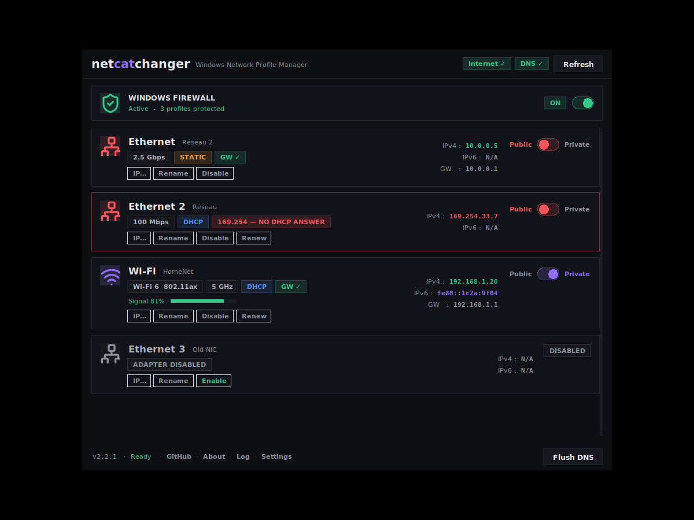

# NetCatChanger

Windows Network Profile Manager + Firewall Control



## Features

- Every network adapter on one screen — including disabled and unplugged ones —
  with IP, gateway, DNS, Wi-Fi signal / standard / band, DHCP or static
- Switch an interface between Private and Public in one click, with Undo
- Tray icon: switch profiles without opening the window; close to tray
- IP presets: save DHCP or static configurations (IP / mask / gateway / DNS)
  and apply them in one click, with an automatic 15-second rollback if the
  new settings cut you off
- Firewall control per active profile, with timed disable (10 min / 1 h)
  that re-enables itself
- Built-in diagnostics: gateway reachable, DNS answering, internet access,
  and APIPA (169.254.x.x) flagged in red
- Flush DNS / renew DHCP lease / enable, disable, rename adapters
- Session log of every change in `%APPDATA%\NetCatChanger`

## Requirements

- Windows 10 / 11
- Python 3.8+  https://python.org  (check "Add to PATH" during install)

## Build

Double-click `scripts\build_windows.bat`

The script does everything automatically:
1. Installs PyInstaller + Pillow + pystray via pip
2. Generates `assets\app_icon.ico`
3. Compiles `NetCatChanger.exe` via PyInstaller
4. Builds the Windows installer (`NetCatChanger-Setup-x.y.z.exe`) if
   [Inno Setup 6](https://jrsoftware.org/isinfo.php) is installed —
   otherwise you still get the portable exe

You can also trigger a build without a Windows machine via the
**Build Windows EXE** GitHub Actions workflow (Actions tab -> Run workflow).
It runs on a real Windows runner and produces the same `.exe` as an
artifact you can download.

## Run without building

Double-click `scripts\run_as_admin.bat`

## Debug

Double-click `scripts\debug.bat` (shows errors if the app crashes on launch)

## Project structure

```
NetCatChanger/
├── src/                    Application source
│   ├── network_switcher.py Main application
│   ├── icons.py             Pre-rendered icons (no external deps at runtime)
│   ├── gen_icons.py         Dev tool: regenerates icons.py from Lucide SVGs
│   ├── gen_icon.py          Generates assets/app_icon.ico at build time
│   ├── version_info.txt     Windows exe metadata
│   └── fonts/               Poppins Bold (SIL OFL), bundled into the exe
├── installer/               Inno Setup script for the Windows installer
├── assets/                  Icons and images
│   ├── app_icon.ico
│   ├── NetCatChanger.svg    App logo (original artwork)
│   ├── lucide/              Lucide source icons, ISC (see LICENSE-lucide.txt)
│   └── screenshot.png
├── scripts/                 Windows launcher scripts
│   ├── build_windows.bat    Build script (exe)
│   ├── run_as_admin.bat     Launch without building
│   └── debug.bat            Debug launcher
├── tests/                   Offline parsing checks (no Windows needed)
│   └── test_parsing.py
├── version.json             Read by the in-app update check
└── .github/workflows/       CI build (Windows runner via GitHub Actions)
```

## Updates

On launch, NetCatChanger reads `version.json` from this repository and shows
a discreet banner when a newer version exists. Nothing else is sent. If you
fork the project, point `UPDATE_URL` in `src/network_switcher.py` to your own
`version.json`, or remove the check.

## Tests

The parsing helpers run on any OS, Windows not required:

```
python tests/test_parsing.py
```

Covers the `netsh wlan show interfaces` parser against English, French and
German output, band / standard / link-speed normalisation, and PowerShell
quoting.

## Third-party components

- **[Lucide](https://lucide.dev)** — the network and firewall icons
  (`wifi`, `network`, `shield-check`, `shield-off`), ISC License.
  Copyright (c) Lucide Icons and Contributors. Sources kept in
  `assets/lucide/`, full licence in [LICENSE-lucide.txt](LICENSE-lucide.txt).
  Only stroke colour and raster size were changed.
- **[Poppins](https://fonts.google.com/specimen/Poppins)** — the wordmark and
  section titles, SIL Open Font License 1.1, see
  `src/fonts/Poppins-OFL.txt`.

The NetCatChanger logo is original artwork and is covered by the project
licence below.

To regenerate `src/icons.py` after changing the palette or the icon set:

```
pip install cairosvg
npm install lucide-static
python src/gen_icons.py node_modules/lucide-static/icons
```

## License

GNU General Public License v3.0 - see [LICENSE](LICENSE).
